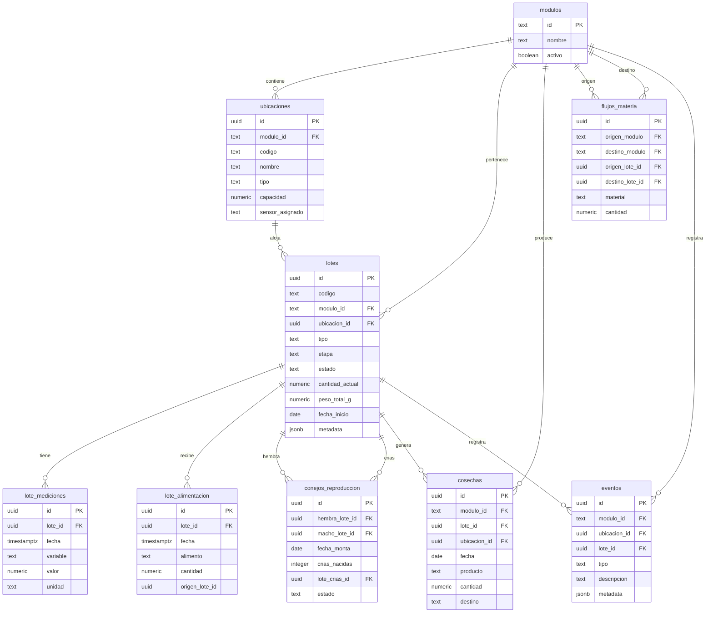
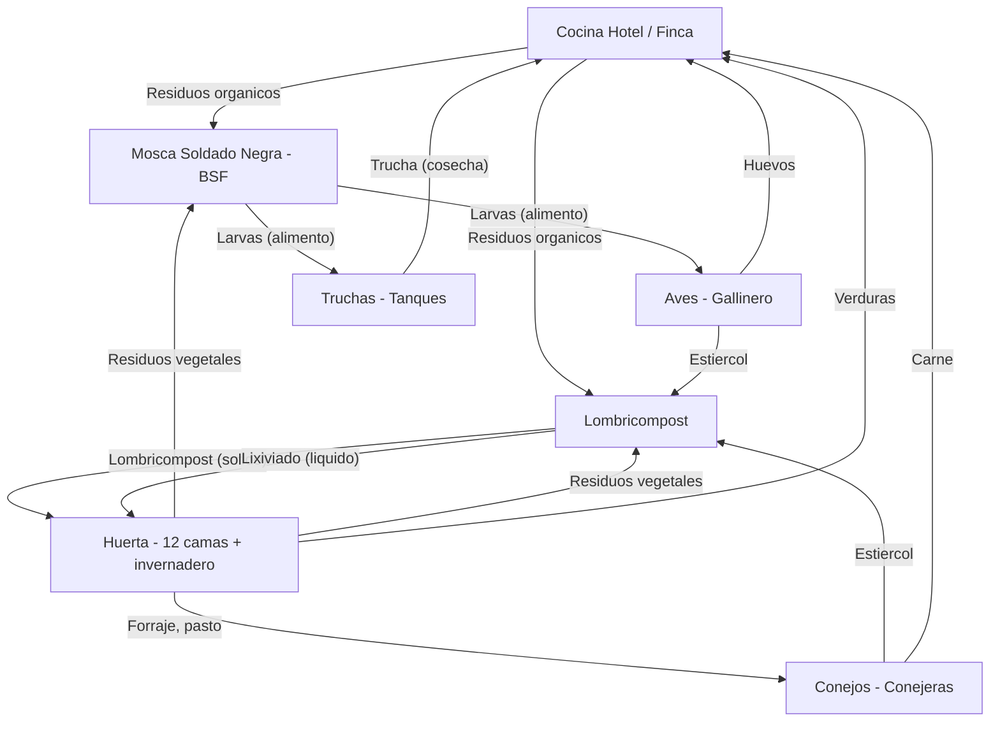
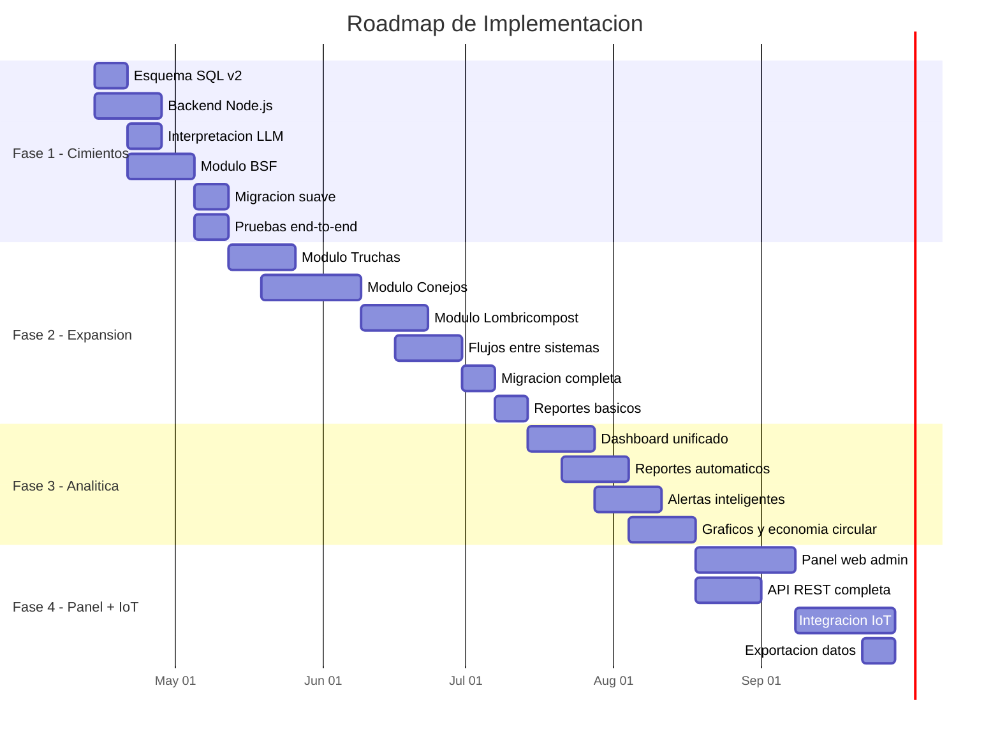

# Analisis de Arquitectura: Sistema de Gestion Productiva Agroecologica

**Finca La Palma y El Tucan -- Zipacon, Cundinamarca, Colombia**

Fecha: 2026-04-09
Autor: Cerebro Claude Code (Arquitectura de Software)
Version: 1.0

---

## Tabla de Contenidos

1. [Resumen Ejecutivo](#1-resumen-ejecutivo)
2. [Diagnostico del Sistema Actual](#2-diagnostico-del-sistema-actual)
3. [Comparacion de Alternativas](#3-comparacion-de-alternativas)
4. [Modelo de Datos Sugerido](#4-modelo-de-datos-sugerido)
5. [Roadmap por Fases](#5-roadmap-por-fases)
6. [Riesgos Tecnicos](#6-riesgos-tecnicos)
7. [Recomendacion Final](#7-recomendacion-final)

---

## 1. Resumen Ejecutivo

La finca La Palma y El Tucan opera actualmente un bot de Telegram (`@HuertaInteligentebot`) que gestiona 12 camas de huerta, un invernadero y un inventario basico de animales (aves, conejos, BSF). El stack actual -- n8n Cloud + Gemini Flash Lite + Supabase -- funciona bien para el volumen presente (~50 mensajes/dia) y cuesta $0 USD/mes. Sin embargo, la arquitectura fue disenada para CRUD simple de plantas y animales individuales, no para modelar ciclos biologicos complejos, lotes productivos ni flujos de materia entre subsistemas.

La expansion a cinco modulos productivos interconectados (BSF, truchas, conejos, lombricompost y huerta con economia circular) requiere un rediseno del modelo de datos y una capa de logica de negocio que n8n no puede manejar de forma limpia. La recomendacion es **mantener Telegram como interfaz principal**, **conservar Supabase como base de datos**, pero **introducir un backend ligero en Node.js** (desplegado en el Droplet existente de DigitalOcean a $6/mes) que maneje la logica de ciclos, lotes y flujos entre sistemas. El bot de n8n se simplifica a un proxy que envia mensajes al backend y devuelve respuestas.

Este enfoque alinea con la directriz de Felipe: "Telegram al frente, backend nuevo modular, base de datos seria, panel admin despues." El costo incremental es cercano a $0 (se usa infraestructura existente), el tiempo estimado para la Fase 1 funcional es de 3-4 semanas, y el sistema queda preparado para agregar un panel web y sensores IoT en fases posteriores sin reescribir lo anterior.

La inversion total estimada para las 4 fases (6 meses) es de $6-12 USD/mes en infraestructura mas tiempo de desarrollo. No se requiere comprar software ni servicios adicionales de pago.

---

## 2. Diagnostico del Sistema Actual

### 2.1 Que funciona bien

| Componente | Estado | Observacion |
|---|---|---|
| Bot Telegram | Estable | Interfaz natural, los usuarios del campo la adoptan rapido |
| Fast-path sin LLM | Eficiente | Confirmaciones, consultas de camas y animales no consumen cuota de Gemini |
| Flujo confirm/ask/memory | Robusto | Resuelve ambiguedad y previene escrituras accidentales |
| Supabase como BD | Funcional | 7 tablas, queries directas, tier gratuito con margen amplio |
| Gemini Flash Lite | Adecuado | Gratis, respuestas en JSON forzado, 250 req/dia sobran |
| Dashboard HTML | Operativo | Sensores en tiempo real, mapa de camas, alertas de riego |
| Alertas Telegram | Activas | 7 tipos de alerta cada 5 min con cooldown de 30 min |
| Costos operativos | $0/mes | Todo en tiers gratuitos (Telegram, Gemini, Supabase, n8n Cloud) |

### 2.2 Limitaciones actuales

**Modelo de datos plano.** Las tablas `animales`, `ordenes`, `actividades`, `costos` y `huevos` fueron disenadas para registros individuales (un pollo = una fila). No hay concepto de "lote", "ciclo de vida", "etapa biologica" ni "flujo de materia". Registrar un lote de 500 larvas BSF que pasa por 4 etapas en 21 dias no encaja en la estructura actual.

**Sin logica de negocio.** n8n ejecuta operaciones CRUD directas contra Supabase. No hay capa intermedia que valide reglas de negocio como: "no puedes vender mas truchas de las que hay en el tanque" o "este lote de BSF ya fue cosechado, no se puede alimentar". Toda la "inteligencia" esta en el system prompt de Gemini, que no tiene acceso al estado real de la BD en el momento de generar la respuesta.

**Sin relaciones entre sistemas.** No existe forma de registrar que las larvas BSF del lote L-003 se usaron para alimentar las gallinas del gallinero, o que el lombricompost de la cama de lombriz CL-2 fue aplicado a la cama 5 de la huerta. Los flujos de economia circular no se capturan.

**Animales solo como conteo.** El sistema actual cuenta animales por tipo/sexo, pero no modela ciclos reproductivos (gestacion, parto, destete), lotes de cria, ni metricas de productividad (conversion alimenticia, tasa de postura, mortalidad por lote).

**Sin reportes analiticos.** No hay queries que respondan: "cuantos kg de larvas produjimos este mes?", "cual es la mortalidad del lote de truchas T-002?", "cuanto lombricompost se aplico a la huerta en marzo?". Los datos entran pero no se analizan.

### 2.3 Deuda tecnica

| Item | Severidad | Descripcion |
|---|---|---|
| add_plantas/remove_plantas incompleto | Media | El nodo solo prepara estructura; falta GET-merge-PATCH. Se usa update_plantas como workaround |
| Sin auditoria de cambios | Baja | Solo `updated_by: "telegram"`. No hay log de quien cambio que, cuando |
| Sin rate limiting | Baja | No es problema con el volumen actual, pero podria serlo si se agregan mas usuarios |
| System prompt monolitico | Media | Un solo prompt de ~560 lineas maneja huerta + animales + ventas + costos + actividades. Agregar BSF/truchas/conejos/lombrices lo haria inmanejable |
| Whitelist hardcodeada en n8n | Baja | Solo un chat_id. Agregar usuarios requiere editar el workflow manualmente |
| GLOSARIO.md desactualizado | Baja | Dice "no maneja ventas con monto" pero el system prompt ya lo soporta |
| Dashboard desconectado del bot | Media | El dashboard HTML lee Ecowitt directamente; el bot lee/escribe Supabase. No comparten estado de forma bidireccional |

### 2.4 Capacidad de escalar

El sistema actual puede absorber **mas volumen** sin problemas (Gemini soporta 250 req/dia, Supabase 50k req/mes). El cuello de botella no es la capacidad, sino la **complejidad del dominio**. Agregar 4 subsistemas productivos con ciclos de vida, lotes y flujos cruzados al prompt actual de Gemini y a las tablas planas de Supabase produciria un sistema fragil, dificil de mantener y propenso a errores de interpretacion del LLM.

**Veredicto:** El sistema actual es un excelente MVP para huerta + animales basicos. Para la expansion agroecologica, necesita un rediseno del modelo de datos y una capa de logica de negocio separada del LLM.

---

## 3. Comparacion de Alternativas

### Alternativa A: Mejorar el bot actual (n8n + Supabase, sin cambios de arquitectura)

**Descripcion:** Agregar tablas nuevas en Supabase, expandir el system prompt de Gemini con los 4 nuevos modulos, y agregar nodos en n8n para cada operacion CRUD nueva.

**Ventajas:**
- Cero cambio de stack -- todo el equipo ya lo conoce
- Implementacion rapida de las primeras operaciones

**Desventajas:**
- System prompt superaria las 1,500 lineas -- Gemini Flash Lite no lo manejaría bien
- n8n se convertiria en un workflow de 50+ nodos con ramas condicionales complejas
- Sin logica de negocio: validaciones imposibles (ej: "no coschar lote que no existe")
- Reportes complejos imposibles desde n8n sin codigo custom extenso
- Cada nuevo subsistema multiplica la complejidad del workflow exponencialmente

### Alternativa B: Telegram + backend nuevo + Supabase rediseñada

**Descripcion:** Mantener Telegram como interfaz. Crear un backend en Node.js que reciba los mensajes via webhook, los procese con el LLM, aplique logica de negocio, y ejecute operaciones contra una Supabase rediseñada con esquema relacional completo. n8n se reduce a un proxy simple o se elimina del flujo principal.

**Ventajas:**
- Logica de negocio real (validaciones, ciclos, flujos)
- Modelo de datos relacional correcto para lotes y ciclos biologicos
- Prompt del LLM mas limpio (solo interpretacion de lenguaje, no logica)
- Facil de testear y depurar (es codigo, no nodos visuales)
- Se despliega en el Droplet existente ($0 extra)

**Desventajas:**
- Requiere desarrollo de codigo (Node.js)
- Migracion de datos del sistema actual
- Curva de aprendizaje si Felipe quiere hacer cambios el mismo

### Alternativa C: Telegram + panel web/admin + BD central

**Descripcion:** Todo lo de la alternativa B mas un panel web de administracion desde el inicio donde se pueden ver dashboards, editar lotes, generar reportes y gestionar configuraciones.

**Ventajas:**
- Experiencia de usuario completa desde el dia 1
- Reportes visuales y graficos
- Gestion avanzada que no cabe en Telegram

**Desventajas:**
- Doble esfuerzo de desarrollo (backend + frontend web)
- El panel web no se usa en el campo (el equipo usa el telefono)
- Retrasa la entrega de la funcionalidad core 2-3 meses
- Mayor superficie de mantenimiento

### Alternativa D: Arquitectura modular con preparacion IoT

**Descripcion:** Todo lo de la alternativa B pero con una arquitectura de microservicios o modulos desacoplados, bus de eventos, y preparacion para recibir datos de sensores IoT (temperatura de agua, oxigeno, peso automatico).

**Ventajas:**
- Maxima escalabilidad y flexibilidad
- Preparada para cualquier integracion futura
- Cada modulo se puede desarrollar y desplegar independientemente

**Desventajas:**
- Sobreingeniera para la escala actual (1 finca, 3-5 usuarios)
- Complejidad operacional alta (multiples servicios, deployment, monitoreo)
- Costo y tiempo significativamente mayores
- Riesgo de "construir para el futuro" y no terminar el presente

### Tabla Comparativa

| Criterio | A (Mejorar actual) | B (Backend nuevo) | C (Backend + Panel) | D (Modular + IoT) |
|---|:---:|:---:|:---:|:---:|
| Facilidad de uso en campo | 5 | 5 | 4 | 4 |
| Escalabilidad | 2 | 4 | 4 | 5 |
| Robustez de datos | 2 | 5 | 5 | 5 |
| Ciclos biologicos y lotes | 1 | 5 | 5 | 5 |
| Capacidad analitica/reportes | 1 | 3 | 5 | 5 |
| Tiempo de desarrollo | 5 | 4 | 2 | 1 |
| Costo de desarrollo | 5 | 4 | 2 | 1 |
| Riesgos tecnicos | 4 | 3 | 3 | 2 |
| **TOTAL** | **25** | **33** | **30** | **28** |

**Puntuacion:** 1 = peor, 5 = mejor. El total pondera igual todos los criterios.

**Analisis:** La alternativa B obtiene la mejor puntuacion global. Ofrece el mejor balance entre capacidad tecnica y pragmatismo. La alternativa C es similar pero penaliza en tiempo y costo sin agregar valor inmediato en campo. La alternativa D es la mas potente pero innecesariamente compleja para la escala actual. La alternativa A es la mas rapida pero no resuelve el problema fundamental.

---

## 4. Modelo de Datos Sugerido

### 4.1 Principios de diseno

1. **Lotes como entidad central.** Cada grupo productivo (larvas, truchas, conejos, lombrices) se gestiona por lotes, no por individuos. Un lote tiene un ciclo de vida con etapas y un historial de eventos.

2. **Tabla unificada de eventos.** Una tabla `eventos` captura todo lo que pasa en la finca: alimentaciones, cosechas, mortalidades, mediciones, transferencias entre sistemas. Esto permite queries transversales y reportes.

3. **Flujos entre sistemas.** Una tabla `flujos_materia` registra cada movimiento de recursos entre subsistemas (ej: "10 kg de larvas BSF del lote L-003 se destinaron a alimentar gallinas").

4. **Retrocompatibilidad.** Las tablas existentes (`huerta_camas`, `huerta_bitacora`, `animales`, etc.) se mantienen operativas. Las nuevas tablas se agregan en paralelo. La migracion es gradual.

### 4.2 Esquema de tablas nuevas

#### Tabla: `modulos`
Define los subsistemas productivos de la finca.

```sql
CREATE TABLE modulos (
    id TEXT PRIMARY KEY,           -- 'huerta', 'aves', 'bsf', 'truchas', 'conejos', 'lombrices'
    nombre TEXT NOT NULL,
    descripcion TEXT,
    activo BOOLEAN DEFAULT true,
    created_at TIMESTAMPTZ DEFAULT now()
);
```

#### Tabla: `ubicaciones`
Donde se realizan las actividades productivas.

```sql
CREATE TABLE ubicaciones (
    id UUID PRIMARY KEY DEFAULT gen_random_uuid(),
    modulo_id TEXT REFERENCES modulos(id),
    codigo TEXT NOT NULL UNIQUE,    -- 'cama-01', 'tanque-01', 'bandeja-bsf-01', 'cama-lombriz-01', 'conejera-01'
    nombre TEXT NOT NULL,
    tipo TEXT NOT NULL,             -- 'cama_huerta', 'invernadero', 'tanque', 'bandeja', 'cama_lombriz', 'conejera', 'gallinero'
    capacidad NUMERIC,             -- m2, litros, kg segun tipo
    unidad_capacidad TEXT,         -- 'm2', 'litros', 'kg'
    sensor_asignado TEXT,          -- soil_ch1..ch5, sensor_agua_01, etc.
    activo BOOLEAN DEFAULT true,
    metadata JSONB DEFAULT '{}',   -- datos extra flexibles
    created_at TIMESTAMPTZ DEFAULT now()
);
```

#### Tabla: `lotes`
Entidad central para BSF, truchas, conejos y cualquier produccion por lotes.

```sql
CREATE TABLE lotes (
    id UUID PRIMARY KEY DEFAULT gen_random_uuid(),
    codigo TEXT NOT NULL UNIQUE,    -- 'BSF-001', 'TRUCH-001', 'CON-001', 'LOMB-001'
    modulo_id TEXT REFERENCES modulos(id),
    ubicacion_id UUID REFERENCES ubicaciones(id),
    tipo TEXT NOT NULL,             -- 'bsf', 'trucha', 'conejo', 'lombriz'
    etapa TEXT NOT NULL,            -- ver etapas por tipo abajo
    estado TEXT DEFAULT 'activo',   -- 'activo', 'cosechado', 'finalizado', 'perdido'
    cantidad_inicial NUMERIC,
    cantidad_actual NUMERIC,
    unidad TEXT,                    -- 'unidades', 'kg', 'gramos'
    peso_total_g NUMERIC,          -- peso del lote en gramos
    fecha_inicio DATE NOT NULL,
    fecha_estimada_fin DATE,
    fecha_real_fin DATE,
    procedencia TEXT,               -- 'propio', 'compra', 'donacion'
    costo_adquisicion NUMERIC DEFAULT 0,
    notas TEXT,
    metadata JSONB DEFAULT '{}',   -- datos especificos del tipo
    created_at TIMESTAMPTZ DEFAULT now(),
    updated_at TIMESTAMPTZ DEFAULT now()
);
```

**Etapas por tipo de lote:**

| Tipo | Etapas validas |
|---|---|
| bsf | huevo, larva, prepupa, pupa, adulto, cosechado |
| trucha | alevin, juvenil, engorde, cosecha |
| conejo | cria, destete, engorde, reproductor, gestante |
| lombriz | activo, en_cosecha, cosechado |

#### Tabla: `lote_mediciones`
Registros periodicos de variables por lote.

```sql
CREATE TABLE lote_mediciones (
    id UUID PRIMARY KEY DEFAULT gen_random_uuid(),
    lote_id UUID REFERENCES lotes(id),
    fecha TIMESTAMPTZ DEFAULT now(),
    variable TEXT NOT NULL,         -- 'peso_total', 'temperatura', 'humedad', 'ph', 'oxigeno', 'densidad', 'mortalidad'
    valor NUMERIC NOT NULL,
    unidad TEXT,                    -- 'g', 'kg', 'celsius', '%', 'mg/l', 'peces/m3'
    registrado_por TEXT DEFAULT 'telegram',
    notas TEXT
);
```

#### Tabla: `lote_alimentacion`
Control de alimentacion por lote.

```sql
CREATE TABLE lote_alimentacion (
    id UUID PRIMARY KEY DEFAULT gen_random_uuid(),
    lote_id UUID REFERENCES lotes(id),
    fecha TIMESTAMPTZ DEFAULT now(),
    alimento TEXT NOT NULL,         -- 'residuos_cocina', 'concentrado', 'larvas_bsf', 'pasto', 'forraje'
    cantidad NUMERIC NOT NULL,
    unidad TEXT NOT NULL,           -- 'kg', 'g', 'litros'
    origen_lote_id UUID,            -- si el alimento viene de otro lote (ej: larvas BSF)
    origen_modulo TEXT,             -- 'bsf', 'huerta', 'cocina', 'externo'
    costo NUMERIC DEFAULT 0,
    registrado_por TEXT DEFAULT 'telegram'
);
```

#### Tabla: `conejos_reproduccion`
Ciclos reproductivos de conejos.

```sql
CREATE TABLE conejos_reproduccion (
    id UUID PRIMARY KEY DEFAULT gen_random_uuid(),
    hembra_lote_id UUID REFERENCES lotes(id),
    macho_lote_id UUID REFERENCES lotes(id),
    fecha_monta DATE NOT NULL,
    fecha_parto_estimada DATE,      -- monta + 31 dias
    fecha_parto_real DATE,
    crias_nacidas INTEGER,
    crias_vivas INTEGER,
    crias_muertas INTEGER DEFAULT 0,
    fecha_destete DATE,             -- parto + 35 dias
    lote_crias_id UUID REFERENCES lotes(id),  -- lote creado para las crias
    estado TEXT DEFAULT 'gestante', -- 'gestante', 'parida', 'destetada', 'fallida'
    notas TEXT,
    created_at TIMESTAMPTZ DEFAULT now()
);
```

#### Tabla: `cosechas`
Produccion obtenida de cualquier modulo.

```sql
CREATE TABLE cosechas (
    id UUID PRIMARY KEY DEFAULT gen_random_uuid(),
    modulo_id TEXT REFERENCES modulos(id),
    lote_id UUID REFERENCES lotes(id),       -- null para huerta
    ubicacion_id UUID REFERENCES ubicaciones(id),
    fecha DATE NOT NULL,
    producto TEXT NOT NULL,         -- 'larvas_bsf', 'trucha', 'conejo_carne', 'lombricompost', 'lixiviado', 'lechuga_crespa', 'huevos'
    cantidad NUMERIC NOT NULL,
    unidad TEXT NOT NULL,           -- 'kg', 'g', 'litros', 'unidades'
    destino TEXT,                   -- 'gallinas', 'truchas', 'huerta', 'cocina_hotel', 'venta', 'autoconsumo'
    destino_lote_id UUID,           -- si va a otro lote
    precio_venta NUMERIC,          -- si se vende
    registrado_por TEXT DEFAULT 'telegram',
    notas TEXT,
    created_at TIMESTAMPTZ DEFAULT now()
);
```

#### Tabla: `flujos_materia`
La tabla clave para la economia circular. Registra cada movimiento de recursos entre subsistemas.

```sql
CREATE TABLE flujos_materia (
    id UUID PRIMARY KEY DEFAULT gen_random_uuid(),
    fecha TIMESTAMPTZ DEFAULT now(),
    origen_modulo TEXT REFERENCES modulos(id),
    origen_ubicacion_id UUID REFERENCES ubicaciones(id),
    origen_lote_id UUID REFERENCES lotes(id),
    destino_modulo TEXT REFERENCES modulos(id),
    destino_ubicacion_id UUID REFERENCES ubicaciones(id),
    destino_lote_id UUID REFERENCES lotes(id),
    material TEXT NOT NULL,         -- 'larvas_bsf', 'lombricompost', 'lixiviado', 'estiercol', 'residuos_organicos', 'forraje'
    cantidad NUMERIC NOT NULL,
    unidad TEXT NOT NULL,
    registrado_por TEXT DEFAULT 'telegram',
    notas TEXT,
    created_at TIMESTAMPTZ DEFAULT now()
);
```

#### Tabla: `eventos`
Tabla unificada de log para todo lo que pasa en la finca. Complementa (no reemplaza) las tablas especificas.

```sql
CREATE TABLE eventos (
    id UUID PRIMARY KEY DEFAULT gen_random_uuid(),
    fecha TIMESTAMPTZ DEFAULT now(),
    modulo_id TEXT REFERENCES modulos(id),
    ubicacion_id UUID REFERENCES ubicaciones(id),
    lote_id UUID REFERENCES lotes(id),
    tipo TEXT NOT NULL,             -- 'alimentacion', 'medicion', 'cosecha', 'mortalidad', 'cambio_etapa', 'flujo', 'observacion', 'vacunacion', 'siembra', 'riego', 'plaga', 'venta', 'compra'
    subtipo TEXT,                   -- detalle del tipo
    descripcion TEXT,
    cantidad NUMERIC,
    unidad TEXT,
    valor_monetario NUMERIC,
    registrado_por TEXT DEFAULT 'telegram',
    metadata JSONB DEFAULT '{}',
    created_at TIMESTAMPTZ DEFAULT now()
);

-- Indices para queries frecuentes
CREATE INDEX idx_eventos_fecha ON eventos(fecha);
CREATE INDEX idx_eventos_modulo ON eventos(modulo_id);
CREATE INDEX idx_eventos_lote ON eventos(lote_id);
CREATE INDEX idx_eventos_tipo ON eventos(tipo);
CREATE INDEX idx_lotes_modulo ON lotes(modulo_id);
CREATE INDEX idx_lotes_estado ON lotes(estado);
CREATE INDEX idx_lote_mediciones_lote ON lote_mediciones(lote_id);
CREATE INDEX idx_flujos_origen ON flujos_materia(origen_modulo);
CREATE INDEX idx_flujos_destino ON flujos_materia(destino_modulo);
```

### 4.3 Diagrama Entidad-Relacion



### 4.4 Diagrama de Flujos de Economia Circular



### 4.5 Compatibilidad con tablas existentes

Las tablas actuales se mantienen intactas durante la transicion:

| Tabla existente | Accion | Plan |
|---|---|---|
| `huerta_camas` | Mantener | Se crea un registro equivalente en `ubicaciones` con tipo='cama_huerta'. Las dos coexisten hasta migrar completamente |
| `huerta_bitacora` | Mantener | Los nuevos eventos de huerta van a `eventos`. Historico permanece consultable |
| `animales` | Mantener | Las aves existentes siguen en esta tabla. Nuevos lotes productivos van a `lotes` |
| `ordenes` | Mantener | Ventas viejas permanecen. Nuevas ventas/cosechas van a `cosechas` y `eventos` |
| `costos` | Mantener | Se migra gradualmente a `eventos` con tipo='compra' y valor_monetario |
| `huevos` | Mantener | Produccion de huevos va tambien a `cosechas` con producto='huevos' |
| `huerta_bot_state` | Mantener | Estado de conversacion del bot sigue igual |
| `actividades` | Mantener | Vacunaciones y cuidados migran gradualmente a `eventos` |

---

## 5. Roadmap por Fases

### Fase 1: Cimientos (Semanas 1-4)

**Objetivo:** Backend funcional con BSF como primer modulo nuevo, sin romper nada existente.

**Entregables:**

| # | Entregable | Descripcion | Semana |
|---|---|---|---|
| 1.1 | Esquema SQL v2 | Crear tablas `modulos`, `ubicaciones`, `lotes`, `lote_mediciones`, `lote_alimentacion`, `eventos`, `flujos_materia`, `cosechas` en Supabase | 1 |
| 1.2 | Backend Node.js | Servicio Express minimo desplegado en el Droplet DigitalOcean (PM2). Endpoints: `/webhook/telegram` (recibe mensajes), `/api/lotes`, `/api/eventos` | 1-2 |
| 1.3 | Interpretacion LLM | El backend llama a Gemini (o Claude Haiku) para interpretar mensajes. El prompt se divide en modulos: uno base + uno por subsistema activo. Solo se carga el modulo relevante | 2 |
| 1.4 | Modulo BSF | CRUD completo de lotes BSF via Telegram: crear lote, cambiar etapa, registrar alimentacion, registrar medicion (peso, temperatura), cosechar lote | 2-3 |
| 1.5 | Migracion suave | El bot existente sigue funcionando en n8n para huerta y animales. El backend nuevo solo atiende comandos de BSF. Un router en n8n decide a donde enviar | 3 |
| 1.6 | Comandos BSF en Telegram | "nuevo lote bsf bandeja 1", "alimentar lote BSF-001 con 2 kg de residuos", "lote BSF-001 paso a prepupa", "cosechar lote BSF-001 3.5 kg de larvas", "cuantos lotes bsf activos" | 3-4 |
| 1.7 | Pruebas end-to-end | Probar flujo completo con datos reales del campo | 4 |

**Costo estimado:** $0 extra (Droplet existente, Supabase gratuito, Gemini gratuito)

### Fase 2: Expansion productiva (Semanas 5-12)

**Objetivo:** Agregar truchas, conejos y lombricompost. Registrar flujos entre sistemas.

**Entregables:**

| # | Entregable | Descripcion | Semana |
|---|---|---|---|
| 2.1 | Modulo Truchas | Lotes por tanque. Crear lote de alevines, registrar mortalidad, mediciones (peso, temp agua, oxigeno, pH), alimentacion (concentrado + larvas BSF), cosecha | 5-6 |
| 2.2 | Modulo Conejos | Lotes por conejera. Ciclos reproductivos (monta, gestacion, parto, destete). Conteo de crias, mortalidad, cambio de etapa (cria -> engorde -> reproductor) | 6-8 |
| 2.3 | Modulo Lombricompost | Camas de lombriz. Alimentacion (residuos, estiercol), mediciones (humedad, pH, temperatura), cosecha de humus solido y lixiviado | 8-9 |
| 2.4 | Flujos entre sistemas | Tabla `flujos_materia` operativa. "usar 5 kg de larvas BSF-003 para alimentar truchas tanque 1", "aplicar 20 kg de lombricompost a cama 3" | 9-10 |
| 2.5 | Migracion completa | Mover huerta y animales existentes al backend nuevo. Retirar workflow de n8n del flujo principal (n8n queda solo para alertas de sensores) | 10-11 |
| 2.6 | Reportes basicos via Telegram | "resumen semanal", "produccion de huevos este mes", "mortalidad truchas tanque 1", "cuanto lombricompost produjimos" | 11-12 |

**Costo estimado:** $0 extra. Si el volumen de mensajes supera el tier gratuito de Gemini, ~$2-5 USD/mes.

### Fase 3: Analitica y optimizacion (Meses 3-4)

**Objetivo:** Extraer valor de los datos acumulados. Mejorar la experiencia del equipo.

**Entregables:**

| # | Entregable | Descripcion |
|---|---|---|
| 3.1 | Dashboard unificado | Nuevo dashboard HTML (o evolucion del existente) que muestre todos los modulos: sensores + lotes activos + produccion + flujos. Desplegado en GitHub Pages |
| 3.2 | Reportes automaticos | Bot envia resumen semanal los domingos: produccion, mortalidad, gastos, alertas. Configurable por modulo |
| 3.3 | Alertas inteligentes | Ademas de las de sensores Ecowitt, alertas por: lote BSF listo para cosechar, parto de coneja inminente, truchas en densidad critica, lombricompost listo |
| 3.4 | Graficos de tendencia | "grafico de produccion de huevos ultimo mes", "curva de peso truchas tanque 1". El bot genera imagen y la envia por Telegram |
| 3.5 | Economia circular visible | Reporte mensual de flujos: cuantos kg entraron/salieron de cada modulo, balance de la finca |
| 3.6 | Multi-usuario | Agregar mas personas al bot con roles (admin, registrador, solo-lectura). Cada accion queda trazada al usuario |

**Costo estimado:** $0-6 USD/mes (posible upgrade de Supabase si la BD supera 500 MB)

### Fase 4: Panel admin + IoT (Meses 4-6)

**Objetivo:** Interfaz web para gestion avanzada y preparacion para sensores automaticos.

**Entregables:**

| # | Entregable | Descripcion |
|---|---|---|
| 4.1 | Panel web admin | Aplicacion web (React o similar) con: vista de todos los modulos, edicion de lotes, reportes exportables, configuracion de alertas. Desplegado en el Droplet o Vercel |
| 4.2 | API REST completa | Endpoints documentados para cada entidad. El panel web y el bot usan la misma API |
| 4.3 | Integracion sensores IoT | Recibir datos de sensores de temperatura de agua (truchas), humedad de camas de lombriz, peso automatico. Protocolo: Ecowitt API o MQTT segun sensor |
| 4.4 | Historial y auditoria | Cada cambio se registra con usuario, fecha, valor anterior y valor nuevo. Permite deshacer errores |
| 4.5 | Exportacion de datos | Exportar a CSV/Excel para analisis externo o reportes a Felipe |

**Costo estimado:** $6-12 USD/mes (Droplet puede necesitar upgrade a $12/mes para el panel web)

### Diagrama de fases



---

## 6. Riesgos Tecnicos

### R1: Complejidad del system prompt del LLM

| Aspecto | Detalle |
|---|---|
| Probabilidad | Alta |
| Impacto | Alto |
| Descripcion | Con 5 modulos productivos, el prompt del LLM podria superar los 3,000 tokens de instrucciones. Gemini Flash Lite podria confundir acciones entre modulos (registrar mortalidad de truchas cuando el usuario hablo de pollitos) |
| Mitigacion | Dividir el prompt en modulos. Un clasificador previo (regex o LLM ligero) detecta el modulo y solo carga las instrucciones relevantes. Ejemplo: si el mensaje contiene "lote bsf" o "larvas", solo se carga el prompt de BSF. Si contiene "cama" o "cosecha", se carga el de huerta. Se mantiene un prompt base pequeno con reglas generales |

### R2: Perdida de datos durante la migracion

| Aspecto | Detalle |
|---|---|
| Probabilidad | Media |
| Impacto | Alto |
| Descripcion | Al migrar del sistema actual al nuevo, podrian perderse registros historicos o corromperse relaciones |
| Mitigacion | No migrar, coexistir. Las tablas viejas permanecen de solo lectura. Las nuevas tablas arrancan con datos frescos. Solo se migra al final de la Fase 2, y con un script de validacion que compare conteos. Se hace backup de Supabase antes de cada migracion |

### R3: El Droplet de DigitalOcean no aguanta la carga

| Aspecto | Detalle |
|---|---|
| Probabilidad | Baja |
| Impacto | Medio |
| Descripcion | El Droplet actual ($6/mes, 1 vCPU, 1 GB RAM) corre Sofia Bot. Agregar el backend de la huerta podria saturar la memoria |
| Mitigacion | Node.js con Express es ligero (~50-80 MB de RAM). Sofia Bot usa ~100 MB. Con 1 GB hay margen. Monitorear con `htop` y PM2. Si se satura, upgrade a $12/mes (2 GB RAM) resuelve el problema inmediatamente |

### R4: Gemini Flash Lite deja de ser gratuito o cambia limites

| Aspecto | Detalle |
|---|---|
| Probabilidad | Media |
| Impacto | Medio |
| Descripcion | Google podria modificar el tier gratuito de Gemini, reduciendo los 250 req/dia o eliminandolo |
| Mitigacion | El backend esta disenado para cambiar de LLM sin reescribir. La interfaz con el modelo es una funcion aislada que recibe un prompt y devuelve JSON. Se puede migrar a Claude Haiku ($0.25/MTok input), Groq (gratis), o un modelo local si fuera necesario. Ademas, el fast-path sin LLM maneja las operaciones mas frecuentes |

### R5: Adopcion en campo -- el equipo no usa los nuevos comandos

| Aspecto | Detalle |
|---|---|
| Probabilidad | Media |
| Impacto | Alto |
| Descripcion | Si los comandos para BSF/truchas/conejos/lombrices son complicados o poco intuitivos, el equipo volvera a registrar en cuaderno o no registrar |
| Mitigacion | Disenar los comandos para que sigan el mismo patron conversacional que la huerta. "nuevo lote bsf" es tan simple como "cama 1". Hacer sesiones de prueba con el equipo de campo antes de cada fase. El LLM debe entender lenguaje natural, no comandos exactos |

### R6: Inconsistencia entre el dashboard y la base de datos

| Aspecto | Detalle |
|---|---|
| Probabilidad | Media |
| Impacto | Bajo |
| Descripcion | El dashboard HTML actual lee sensores desde Ecowitt y camas desde localStorage. Las nuevas tablas estaran en Supabase. Podria haber dos "fuentes de verdad" para la misma informacion |
| Mitigacion | En Fase 3, el dashboard se actualiza para leer de Supabase en vez de localStorage. Los sensores Ecowitt siguen leyendose directo de la API (son datos en tiempo real). Supabase es la unica fuente de verdad para datos de gestion |

### R7: El esquema de datos es demasiado complejo desde el inicio

| Aspecto | Detalle |
|---|---|
| Probabilidad | Baja |
| Impacto | Medio |
| Descripcion | El esquema propuesto tiene 8+ tablas nuevas. Si se implementan todas desde el dia 1, podrian aparecer problemas de diseno que son costosos de corregir despues |
| Mitigacion | Implementar solo las tablas necesarias por fase. Fase 1: `modulos`, `ubicaciones`, `lotes`, `lote_mediciones`, `eventos`. Fase 2: agregar `lote_alimentacion`, `conejos_reproduccion`, `cosechas`, `flujos_materia`. El campo `metadata JSONB` absorbe datos no previstos sin necesidad de alterar el esquema |

---

## 7. Recomendacion Final

### La recomendacion: Alternativa B (Telegram + backend Node.js + Supabase rediseñada)

Esta alternativa es la que mejor se alinea con la directriz de Felipe: pragmatica, escalable, con Telegram al frente y un backend serio detras.

### Stack recomendado

| Componente | Tecnologia | Costo |
|---|---|---|
| Interfaz usuario | Telegram Bot API (@HuertaInteligentebot) | $0 |
| Backend | Node.js 20 + Express | $0 |
| Base de datos | Supabase PostgreSQL (tier gratuito, 500 MB) | $0 |
| LLM interpretacion | Gemini 2.5 Flash Lite (250 req/dia gratis) | $0 |
| LLM backup | Claude Haiku 3.5 ($0.25/MTok) | ~$1-2/mes si se activa |
| Hosting backend | Droplet DigitalOcean existente (104.236.89.224) | $0 extra (ya se paga $6/mes) |
| Alertas sensores | n8n Cloud (workflow existente) | $0 extra (incluido en plan actual) |
| Dashboard sensores | GitHub Pages (huerto-dashboard) | $0 |
| **Total mensual** | | **$6/mes** (el Droplet que ya se paga) |

### Por que no las otras alternativas

- **A (mejorar actual):** No escala en complejidad de dominio. El system prompt monolitico y n8n como logica de negocio son un callejon sin salida para 5 subsistemas productivos.

- **C (con panel web desde el inicio):** Agrega 2-3 meses de desarrollo del panel web antes de tener funcionalidad productiva. El equipo de campo no lo usaria (usan el telefono). Mejor agregar el panel en Fase 4 cuando haya datos que justifiquen la inversion.

- **D (microservicios + IoT):** Sobreingenieria para una finca con 3-5 usuarios y 50 mensajes/dia. La complejidad operacional no se justifica. Cuando lleguen los sensores IoT (Fase 4), el backend monolitico de Node.js puede recibir esos datos con un endpoint adicional sin necesidad de un bus de eventos.

### Primer sprint (Semana 1-2)

Las primeras dos semanas deben entregar:

1. **Dia 1-2:** Ejecutar el SQL de las tablas base (`modulos`, `ubicaciones`, `lotes`, `lote_mediciones`, `eventos`) en Supabase. Insertar datos semilla (los 6 modulos, las ubicaciones existentes).

2. **Dia 3-5:** Crear el proyecto Node.js con Express. Endpoint `/webhook/telegram` que recibe mensajes de Telegram. Desplegarlo en el Droplet con PM2.

3. **Dia 6-8:** Implementar el clasificador de modulos (regex simple que detecta si el mensaje es de huerta, animales, BSF, etc.). Conectar con Gemini usando un prompt modular.

4. **Dia 9-10:** CRUD de lotes BSF: crear lote, listar lotes activos, cambiar etapa, registrar peso.

5. **Dia 11-14:** Conectar el bot de Telegram al backend nuevo para comandos BSF. Los comandos de huerta y animales siguen pasando por n8n sin cambios. Probar con datos reales.

**Criterio de exito del primer sprint:** Que alguien en la finca pueda escribir "nuevo lote bsf bandeja 1" y que el sistema cree el lote, y luego "alimentar bsf-001 con 2 kg de residuos de cocina" y que quede registrado. Todo via Telegram, con confirmacion, igual que el sistema actual.

### Mensaje a Felipe

El sistema actual funciona bien y no se toca. Se construye uno nuevo al lado que maneja la complejidad productiva. Telegram sigue siendo la unica interfaz que el equipo necesita por ahora. La base de datos pasa de ser una lista plana a un modelo relacional que entiende lotes, ciclos de vida y flujos entre sistemas. El backend es codigo real donde se pueden poner validaciones, calculos y reportes que n8n no puede hacer. Y cuando tenga sentido, se agrega un panel web para los reportes visuales y la gestion avanzada. Todo corre en la infraestructura que ya tenemos. Costo extra: $0.

---

## Anexo A: Ejemplo de interaccion con los nuevos modulos

### BSF (Mosca Soldado Negra)

```
Usuario: nuevo lote bsf en bandeja 1
Bot:     Vas a crear:
         Lote BSF-004 en Bandeja BSF 1
         Etapa: larva
         Confirmas? (si/no)
Usuario: si
Bot:     Lote BSF-004 creado. Etapa: larva.

Usuario: alimentar bsf-004 con 3 kg de residuos de cocina
Bot:     Vas a registrar:
         Alimentacion BSF-004
         3 kg de residuos de cocina (origen: cocina)
         Confirmas? (si/no)
Usuario: si
Bot:     Registrado.

Usuario: bsf-004 peso 2.8 kg temperatura 28
Bot:     Vas a registrar mediciones BSF-004:
         Peso: 2.8 kg
         Temperatura: 28 C
         Confirmas? (si/no)
Usuario: si
Bot:     Mediciones registradas.

Usuario: cosechar bsf-004 2.5 kg para gallinas
Bot:     Vas a cosechar:
         BSF-004: 2.5 kg de larvas
         Destino: gallinas
         El lote pasa a estado "cosechado"
         Confirmas? (si/no)
Usuario: si
Bot:     Cosecha registrada. Flujo: 2.5 kg larvas BSF -> Gallinas.
```

### Truchas

```
Usuario: nuevo lote de 200 alevines en tanque 1
Bot:     Vas a crear:
         Lote TRUCH-002: 200 alevines en Tanque 1
         Confirmas? (si/no)
Usuario: si
Bot:     Lote TRUCH-002 creado.

Usuario: murieron 5 truchas del tanque 1
Bot:     Vas a registrar mortalidad:
         TRUCH-002: 5 truchas fallecidas
         Cantidad actual: 195
         Confirmas? (si/no)
Usuario: si
Bot:     Registrado. TRUCH-002 ahora tiene 195 truchas.

Usuario: medicion tanque 1 temperatura 16 oxigeno 7.5 ph 7.2
Bot:     Vas a registrar mediciones TRUCH-002:
         Temperatura agua: 16 C
         Oxigeno: 7.5 mg/l
         pH: 7.2
         Confirmas? (si/no)
Usuario: si
Bot:     Mediciones registradas.
```

### Conejos

```
Usuario: montar coneja hembra conejera 1 con macho conejera 2
Bot:     Vas a registrar monta:
         Hembra: CON-001 (Conejera 1)
         Macho: CON-002 (Conejera 2)
         Parto estimado: 2026-05-10
         Confirmas? (si/no)
Usuario: si
Bot:     Monta registrada. Alerta de parto: 2026-05-10.

Usuario: pario la coneja de conejera 1, 7 crias 6 vivas
Bot:     Vas a registrar parto:
         CON-001: 7 crias nacidas, 6 vivas, 1 muerta
         Destete estimado: 2026-06-14
         Confirmas? (si/no)
Usuario: si
Bot:     Parto registrado. Lote CON-005 creado con 6 crias.
```

### Lombricompost

```
Usuario: alimentar cama lombriz 1 con 10 kg de estiercol de gallinas
Bot:     Vas a registrar:
         Alimentacion Cama Lombriz 1 (LOMB-001)
         10 kg de estiercol (origen: gallinas)
         Confirmas? (si/no)
Usuario: si
Bot:     Registrado. Flujo: 10 kg estiercol Gallinas -> Lombrices.

Usuario: coseche 15 kg de lombricompost de cama lombriz 1 para la huerta
Bot:     Vas a registrar cosecha:
         LOMB-001: 15 kg de lombricompost
         Destino: huerta
         Confirmas? (si/no)
Usuario: si
Bot:     Cosecha registrada. Flujo: 15 kg lombricompost -> Huerta.
```

---

## Anexo B: Queries SQL utiles para reportes

### Produccion total por modulo (ultimo mes)

```sql
SELECT
    m.nombre AS modulo,
    c.producto,
    SUM(c.cantidad) AS total,
    c.unidad
FROM cosechas c
JOIN modulos m ON c.modulo_id = m.id
WHERE c.fecha >= CURRENT_DATE - INTERVAL '30 days'
GROUP BY m.nombre, c.producto, c.unidad
ORDER BY m.nombre, total DESC;
```

### Flujos de economia circular (ultimo mes)

```sql
SELECT
    mo.nombre AS origen,
    md.nombre AS destino,
    fm.material,
    SUM(fm.cantidad) AS total_kg,
    fm.unidad
FROM flujos_materia fm
JOIN modulos mo ON fm.origen_modulo = mo.id
JOIN modulos md ON fm.destino_modulo = md.id
WHERE fm.fecha >= CURRENT_DATE - INTERVAL '30 days'
GROUP BY mo.nombre, md.nombre, fm.material, fm.unidad
ORDER BY total_kg DESC;
```

### Lotes activos con metricas

```sql
SELECT
    l.codigo,
    l.tipo,
    l.etapa,
    l.cantidad_actual,
    l.unidad,
    l.peso_total_g / 1000.0 AS peso_kg,
    l.fecha_inicio,
    (CURRENT_DATE - l.fecha_inicio) AS dias_activo,
    u.nombre AS ubicacion
FROM lotes l
JOIN ubicaciones u ON l.ubicacion_id = u.id
WHERE l.estado = 'activo'
ORDER BY l.tipo, l.codigo;
```

### Mortalidad por lote de truchas

```sql
SELECT
    l.codigo,
    l.cantidad_inicial,
    l.cantidad_actual,
    l.cantidad_inicial - l.cantidad_actual AS mortalidad_total,
    ROUND(
        (l.cantidad_inicial - l.cantidad_actual)::NUMERIC / l.cantidad_inicial * 100, 1
    ) AS porcentaje_mortalidad
FROM lotes l
WHERE l.tipo = 'trucha'
ORDER BY porcentaje_mortalidad DESC;
```

### Gastos totales por modulo (ultimo mes)

```sql
SELECT
    m.nombre AS modulo,
    e.tipo,
    COUNT(*) AS operaciones,
    SUM(e.valor_monetario) AS total_gastado
FROM eventos e
JOIN modulos m ON e.modulo_id = m.id
WHERE e.tipo IN ('compra', 'gasto')
    AND e.fecha >= CURRENT_DATE - INTERVAL '30 days'
GROUP BY m.nombre, e.tipo
ORDER BY total_gastado DESC;
```

---

*Documento generado el 2026-04-09 por Cerebro Claude Code*
*Revision: 1.0*
*Para: Felipe Sardi -- La Palma y El Tucan*
